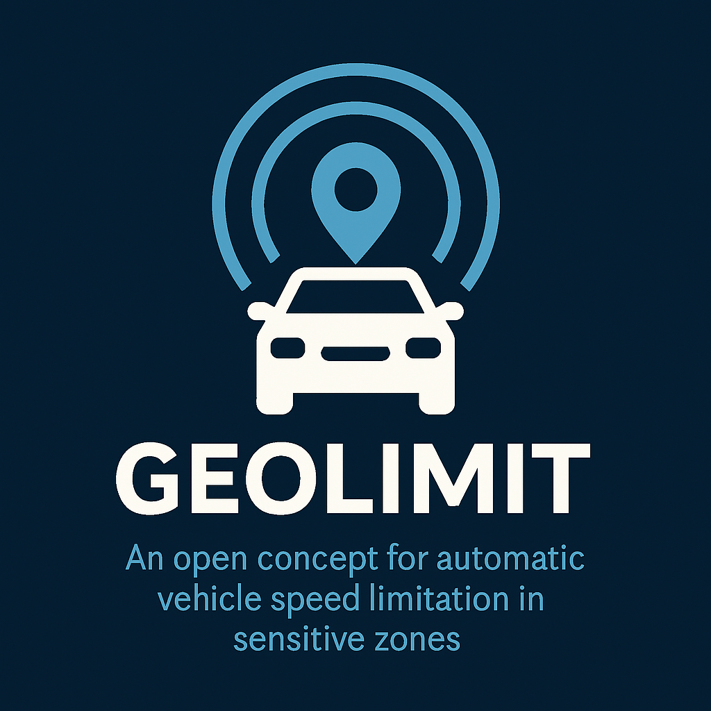

# Geolimit

**An open concept for automatic vehicle speed limitation in sensitive zones.**

Geolimit is a non-profit initiative designed to save lives by limiting vehicle speed through GPS-based geofencing or electromagnetic power reduction in critical areas (e.g. near schools, hospitals, or residential zones).

---

## Key Principles

- Open and transparent design
- Non-commercial and non-invasive
- Respect for driver autonomy and safety
- No surveillance or tracking

---

## Authorship & Originality

This concept was originally created and published by:

**Ľuboš Mesároš**  
Date of publication: **March 30, 2025**  
GitHub link: [https://github.com/lubosmesaros-design/Geolimit](https://github.com/lubosmesaros-design/Geolimit)  
SHA256 Proof:  
`df5908ad73e19a651517c62ed90930203a407b0bd4a550e71bfad226d5e70713`

All files in this repository serve as a public timestamp of authorship and intention.

---

## Documents

- Autorské vyhlásenie / Authorship Declaration
- Whitepaper (SK/EN)
- README (SK/EN)

---

## License

This project is licensed under a modified MIT license with the following clause:  
> **This concept may only be used in civilian applications with the aim of saving lives. Any use for profit, surveillance, military or coercive enforcement is strictly prohibited.**

---
